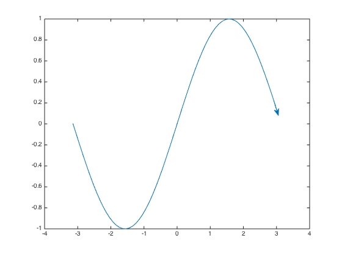
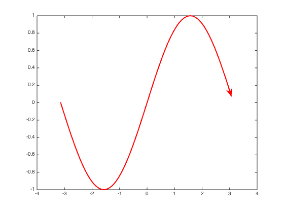
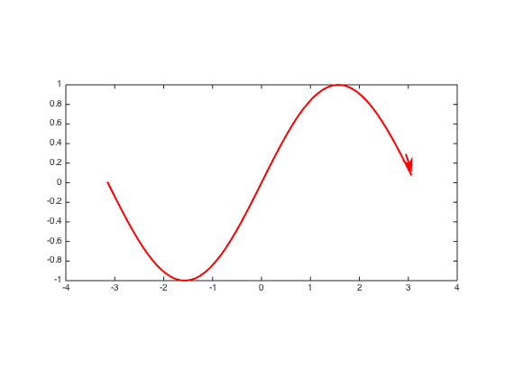
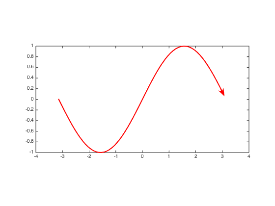
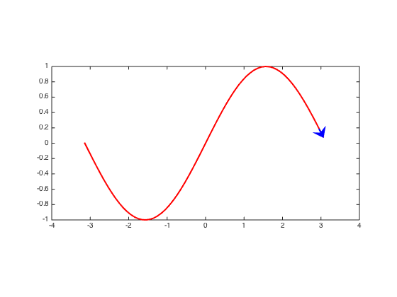

### line2arrow.m Documentation


This line2arrow.m function adds annotation arrows to the end of a line in a 2D Matlab plot.  Annotation arrows (created via the Matlab function `annotation('arrow', x, y)`) are positioned relative to figure coordinates, which can make them difficult to position correctly in terms of axis coordinates.  This function does the figure-to-axes coordinate conversion for you.
 
  Arrows inherit line properties from the line they are attached to, unless
  otherwise specified by the user.  You can also resync the line and arrow
  by clicking on the line.  Resyncing matches the arrow color, line width,
  and line style of the arrows to the lines, and repositions the arrows
  (because annotation arrows use figure units rather than axis units, the
  match between the arrow location and line location will be thrown off
  during some resizing of figures/axes, for example with manual aspect
  ratios).       
 
  Passing a line handle that is already associated with arrows provides the
  same syncing action as clicking on the line, but can also be used to
  manually change some properties.  See example for details.

## Syntax

```
line2arrow(h);
line2arrow(h, param1, val1, ...)
ha = line2arrow(...)
```

See function help for description of input and output variables.

## Examples


Add an arrow to the end of a single line.

```matlab
x = -pi:.1:pi;
y = sin(x);
h = plot(x,y);
line2arrow(h);
```



 The arrow will automatically sync if you change line properties, like
 line width or color.

```matlab
set(h, 'color', 'red', 'linewidth', 2);
```




 Changes to the axis aspect ratios require a manual resync, either by
 clicking on the line object or recalling line2arrow.


```matlab 
set(gca, 'dataaspectratio', [2 1 1]);
```




```matlab
line2arrow(h);
```



 If you manually change things so the arrowhead and line are out of sync
 (color-wise), the clash will remain until another sync takes place.  So
 if you want this in your final image, make sure you don't alter the line
 after setting it as such.

```matlab
line2arrow(h, 'color', 'b', 'headwidth', 20);
```

